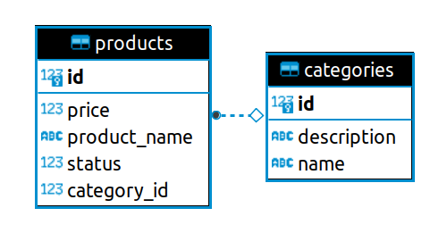

# Lab Shopping List
Lab Shopping List is a REST API with operations to manage a shopping list. After you run the application, you can see all the available operations in the Swagger interface:

[http://localhost:8080/swagger-ui/index.html](http://localhost:8080/swagger-ui/index.html)

## Database diagram


## Steps to run the application

### 1. Create postgres instance

Run the following command to create a new postgres instance using docker:

```shell
docker run --rm -p 5432:5432  --name some-postgres -e POSTGRES_DB=shopping_list -e POSTGRES_PASSWORD=postgres -d postgres
```

Or go to the following link and download and install postgres manually:
[https://www.postgresql.org/download/](https://www.postgresql.org/download/)

### Build the application
To build this project it's necessary to have [Maven](https://maven.apache.org/) installed and a [JDK 17](https://www.oracle.com/java/technologies/javase/jdk17-archive-downloads.html) distribution.

Go to the root folder of the application (where the `pom.xml` file is located) and run the command:

```shell
mvn clean package -Dmaven.test.skip=true
```

### Run the application
Then simply run the application with the command:

```shell
java -jar target/LabShoppingList.jar
```